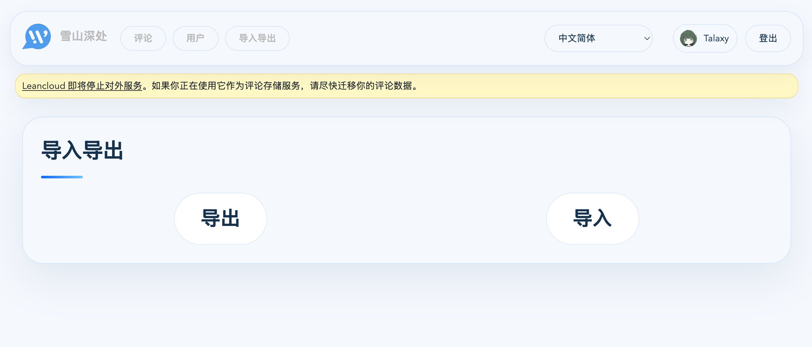

## 写在前面

本来并不打算写这篇文章，毕竟能写的内容不多，但看了下官网的教程，感觉过于分散了，正好最近有空，要不水一篇？来！水一篇！

## 准备

一台 Linux 服务器，本文以 Debian 13 为例。

## 安装 docker

命令行执行：

```shell
bash <(curl -fsSL https://get.docker.com)
```

即可！

## 配置服务目录

先在合适的地方创建一个目录给服务用：

```shell
mkdir waline
```

再在该目录下创建一个 `docker-compose.yml` 文件，内容如下：

```yml
# docker-compose.yml
services:
  waline:
    container_name: waline
    image: lizheming/waline:latest
    restart: always
    ports:
      - 8360:8360
    volumes:
      - ./data:/app/data
    environment:
      TZ: 'Asia/Shanghai'
      SQLITE_PATH: '/app/data'
      JWT_TOKEN: '随机生成的 JWT Token'
      SITE_NAME: '网站名'
      SITE_URL: 'https://example.com'
      SECURE_DOMAINS: 'example.com'
      AUTHOR_EMAIL: 'mail@example.com'

```

根据需要修改 `environment` 的内容，如果在其他平台比如 LeanCloud 配置了环境变量也可以复制到这里来。

最后下载一份[官方的 waline.sqlite](https://github.com/walinejs/waline/blob/main/assets/waline.sqlite) 放在新建的 `data` 目录下。

一切搞好后，目录结构应该如下：

```txt
waline
├── docker-compose.yml
└── data
    └── waline.sqlite
```

## 启动服务

在 `waline` 目录下执行 `docker compose up` 如果没有报错就可以按 d 让它跑在后台了。

一些常用命令：

```shell
# 直接后台运行
docker compose up -d
# 关闭服务
docker compose down
# 更新
docker compose pull
```

## 配置 HTTPS

输入 Caddy 官网的指令即可安装 Caddy：

[$card](https://caddyserver.com/docs/install#debian-ubuntu-raspbian)

安装好后，编辑 `/etc/caddy/Caddyfile` 文件，添加如下配置：

```txt
example.com {
  reverse_proxy localhost:8360
}
```

把域名换成你的域名，并且配置好域名解析后运行 Caddy：

```shell
systemctl start caddy
```

Caddy 就会自动获取证书并且转发请求了，后续我们直接访问该域名，不出意外就能看到 waline 的评论框了。

## 迁移数据

迁移数据可以访问旧后台的管理面板，点击“导出”下载文件，再在新后台中“导入”该文件即可。


