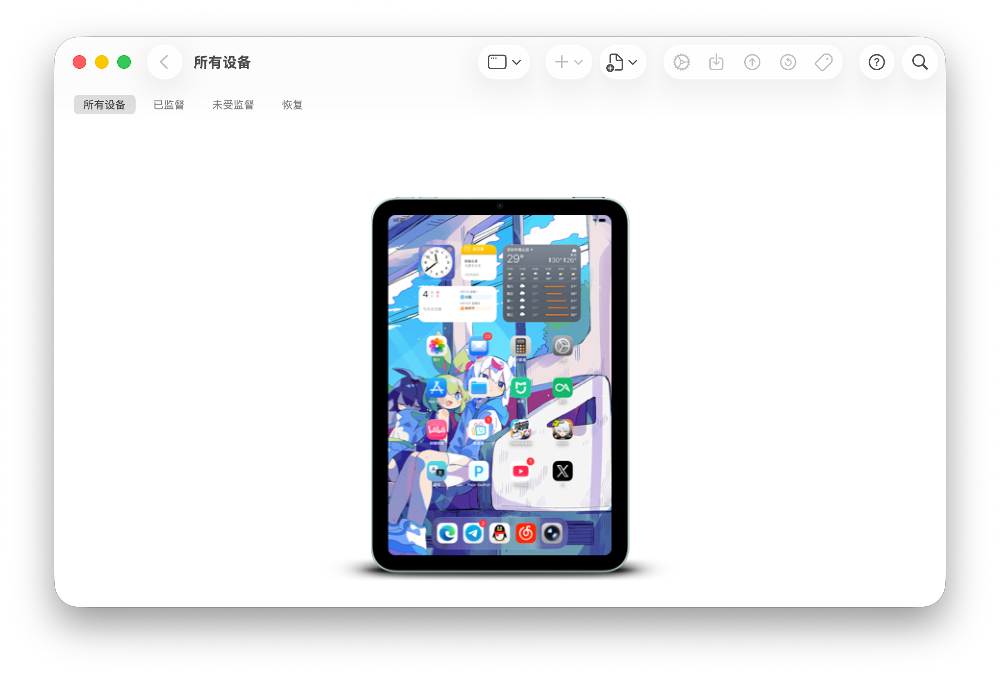

## 关于侧载和签名

iPad 和 iPhone 想要侧载 IPA 文件有很多办法，但最通用的还是自己签名并安装上去，而签名又分为两种：一种是使用自己的 Apple 账号签名，好处是快捷免费，坏处是只有七天有效期；第二种是使用付费的证书，好处是不用频繁地去签名安装，因为这些证书有效期一般是一年，而缺点则是要花钱。网上根据稳定程度和附加服务，价格从 10 元到 50 元不等。

本文介绍的便是第二种签名和安装（侧载）方式。

## 为什么不用这些

但话又说回来，市面上已有很多工具可以方便地操作了——PC 有爱思助手，iOS 有全能签之类的。为什么不用这些？主要原因还是刻在我骨子里的洁癖，这些工具都会在你设备上装个软件，全能签这个没办法，毕竟要用，而爱思助手则是一插设备就给我装上去个我永远用不上的“爱思全能版”。

而如果你正好有一台 Mac，那么有更干净的方式来签名和侧载。

## 签名

签名需要使用 zsign，这是一个开源的工具：

[$card](https://github.com/zhlynn/zsign)

直接使用 brew 安装：

```shell
brew install zsign
```

然后把证书、描述文件和待签名的 IPA 包放一起，目录应该如下：

```txt
├── 证书文件.p12
├── 描述文件.mobileprovision
└── xxx.ipa
```

在该目录下执行：

```shell
zsign -k 证书文件.p12 -p 密码 -m 描述文件.mobileprovision -o xxx-signed.ipa xxx.ipa
```

记得将密码替换为你的证书密码，执行完后就能在目录下看到已经签名好的 IPA 文件了。

## 安装

安装非常简单！可以使用 Apple 官方的 Apple Configurator，在 App Store 就能直接下载到。



把 IPA 文件直接拖到对应设备的图标上就大功告成了，若是闲着没事也可以点进去看看设备信息。

## 最后

复习之余发现之前买的证书到期了，iPad 上的侧载的 APP 都得重新签名了，摸索完后便有了此文。求职之路还是比较坎坷的······这部分就等到年度总结再记录吧！
